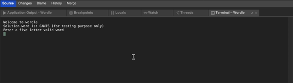
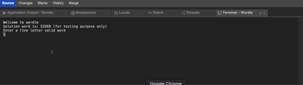

# Wordle game
This is a console based game written in C#, inspired by [wordle](https://en.wikipedia.org/wiki/Wordle) containing basic logic of it.

Actual game can be played [here](https://www.nytimes.com/games/wordle/index.html).

## Game output

Win output

Lost output

